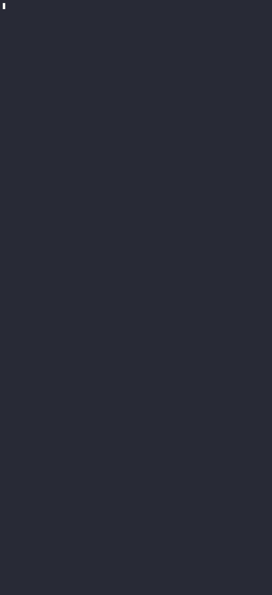

# Agent Offpage

Hệ thống 3 agent + 8 skill cho quy trình SEO Offpage (đi báo PR + guest post), dùng chung cho nhiều dự án khách hàng.

## Demo — agent chạy thật, không dàn dựng

`seo-offpage-technical` phân tích trực tiếp file check TOP thật (`data/hoptri/btk1-thuong-hieu-checktop.csv`) bằng skill `top-rank-backlink-analysis`, tự tính lại % TOP, tự phát hiện lệch KPI, tự đề xuất anchor text.



## Web app — dùng thử trực tiếp trên trình duyệt

**Link chạy thật: https://nguyenthilinhtrang.github.io/offpage-bao-gp/**

Landing page tĩnh (GitHub Pages, không backend), chia rõ 3 khối:
1. **Giới thiệu** — trang này là gì, làm được gì, phần nào miễn phí/phần nào mất phí.
2. **Phần miễn phí** — upload file check TOP, JS chạy thẳng trong trình duyệt (thống kê TOP theo BTK, lọc từ khoá ứng viên đáng đầu tư offpage) và trả kết quả ngay, **không cần API key**.
3. **Phần cần trả phí** — ghép cụm anchor theo chủ đề + chọn domain báo/GP theo ngân sách, cần Claude thật sự hiểu ngữ cảnh nên bắt buộc dùng API key Anthropic của chính người dùng (bring-your-own-key, gọi thẳng tới Anthropic, không qua server nào của mình).

> **Lưu ý:** đây chỉ là bản build thử (proof of concept), không có hosting riêng/trả phí — chạy trên GitHub Pages miễn phí, dừng ở mức thao tác cơ bản, chưa đầu tư hoàn thiện thêm vì không muốn phát sinh chi phí duy trì. Công việc thật hàng ngày của mình vẫn thực hiện trực tiếp trên VS Code tích hợp Claude Code, không qua web app này.

Xem chi tiết kiến trúc ở [`docs/README.md`](docs/README.md).

## Đọc trước

- [`summary.md`](summary.md) — trạng thái dự án, kết quả chạy thử thật (dự án Hợp Trí + Sunlife), lỗi đã phát hiện & sửa.
- [`CLAUDE.md`](CLAUDE.md) — quy ước kiến trúc + quy tắc làm việc.
- [`exports/hoptri-offpage-2026-07-12.md`](exports/hoptri-offpage-2026-07-12.md) — lịch sử trò chuyện đầy đủ lúc build hệ thống và chạy thử dự án Hợp Trí.

## Cấu trúc

```
.claude/agents/*.md          # 3 agent
.claude/skills/<ten-skill>/  # 8 skill
data/<du-an>/                # dữ liệu trung gian theo dự án
outputs/<du-an>/             # deliverable cuối cùng, tách file theo giai đoạn agent
  <DuAn>-AnchorText-<ngay>.xlsx   # output seo-offpage-technical (TOP, KPI, cụm anchor)
  <DuAn>-ChonDomain-<ngay>.xlsx   # output offpage-pm (domain + ngân sách) — deliverable cuối
exports/                     # lịch sử chat + demo ghi hình
```

## 3 agent

- **`seo-offpage-technical`** — phân tích file check TOP, đề xuất anchor text + ghép cụm 2 anchor/bài.
- **`offpage-pm`** — lọc domain báo/GP phù hợp lĩnh vực + ngân sách, chốt danh sách cuối.
- **`offpage-content`** — lên outline và viết content chèn anchor tự nhiên (chỉ dùng khi cần viết bài thật).

Thứ tự chạy chuẩn: `seo-offpage-technical` → `offpage-pm` → (tuỳ chọn) `offpage-content`.
